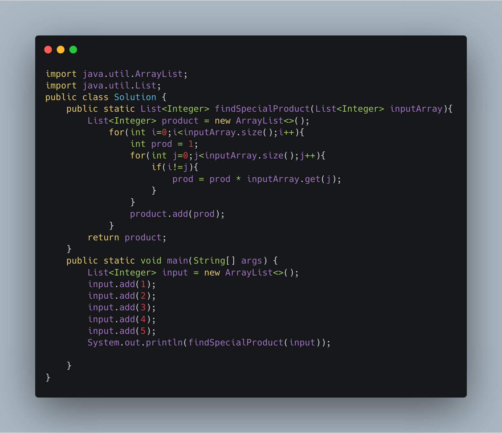

### Array Special Product

------

Implement a function which, given an array of integers, returns a new array for which every index carries the value of the product of the remaining elements.

Example

Given array [1, 3, 2, 4, 5] it would return [120, 40, 60,30, 24]

Given array [4, 10, 3] it would return [30, 12, 40]

Function Description

The function findSpecialProduct accepts the following parameters

- An array of integers "input" of size n.

The function must return a new array of size n in which every index carries the value of the product of the remaining elements.
```
Input Format
1                                                                                                                                                               1 line specifies the number of elements on the array
in[1]                                                                                                                                                           # Next n lines has a list of integers_
in[2]
in[n]
Output Format
out[1]                                                                                                                                                          # output has an array of n integers with each integer in a line.
out[2]
out[n]
```

Sample Test Output
```
5
1
2
3
4
5
```
Output
```
120
60
40
30
24
```

-----


Solution
