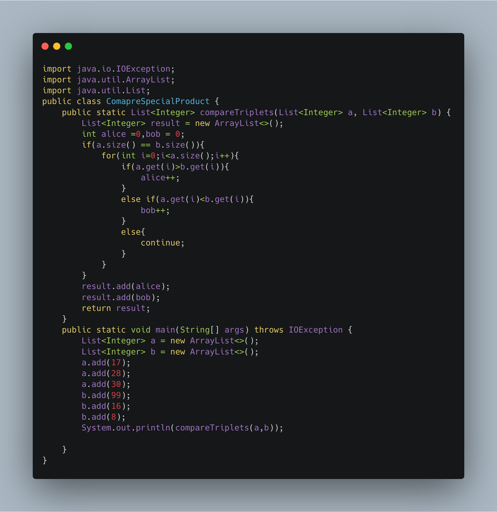

### Compare The Triples

------

Alice and Bob each created one problem for HackerRank. A reviewer rates the two challenges, awarding points on a scale from 1 to 100 for three categories: problem clarity, originality, and difficulty.

 We define the rating for Alice's challenge to be the triplet  a = (a[0],a[1],a[2]), and the rating for Bob's challenge to be the triplet b = (b[0],b[1],b[2]).
 
 Your task is to find their comparison points by comparing  a[i] with b[i]
 
 - if a[i] > b[i] - alice is awarded 1 point
 - if a[i] < b[i] - bob is awarded 1 point
 - if a[i] = b[i] - then neither person receives a point.
 
 Sample Input
```
5 6 7
3 6 10
```

Sample Output
```
1 1
```

Sample Input
```
17 28 30
99 16 8
```
Sample Output
```
2 1
```

-----

Solution


 
 