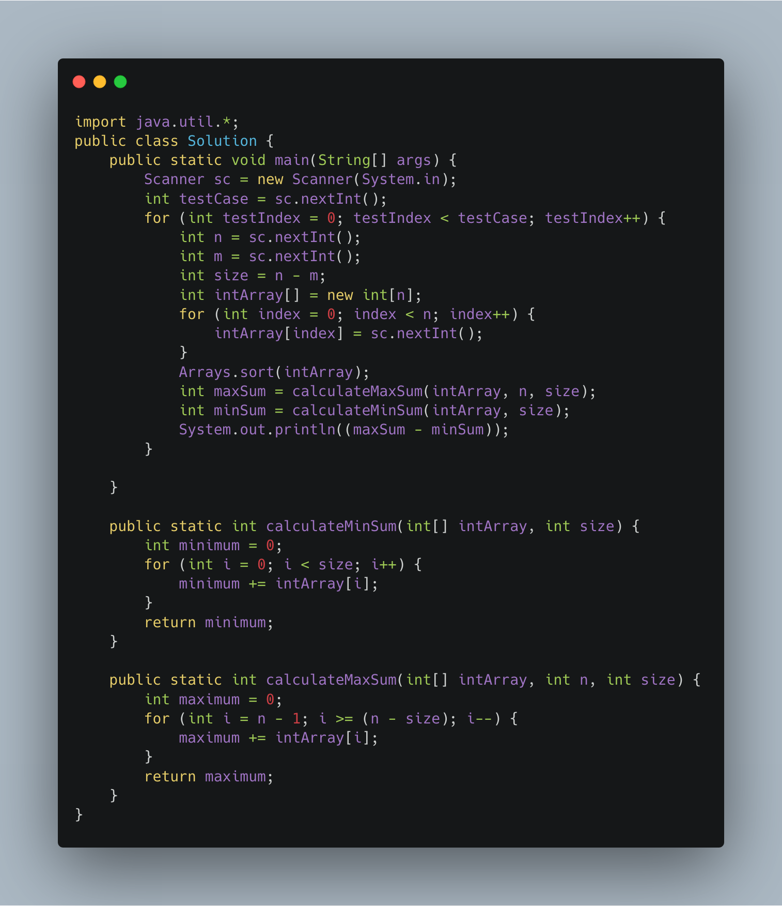

### Difference between maximum sum and minimum sum of N-M elements

------

Your task is to calculate the difference between maximum sum and minimum sum of N-M elements of the given array.

Constraints:
```
1<=t<=10
1<=n<=1000
1<=a[i]<=1000
```

Input:
```
1- First line contains an integer T denoting the number of testcases.
2- First line of every testcase contains two integer N and M.
3- Next line contains N space separated integers denoting the elements of array
```
Output:
```
For every test case print your answer in new line
```

----

Sample Input
```
1
5 1
1 2 3 4 5
```
Sample Output
```
4
```

Explanation
- M is 1 and N is 5 so you have to calculate maximum and minimum sum using (5-1 =) 4 elements.
- Maximum sum using the 4 elements would be (2+3+4+5=)14.
- Minimum sum using the 4 elements would be (1+2+3+4=)10.
- Difference will be 14-10=4.


----

Solution


------

