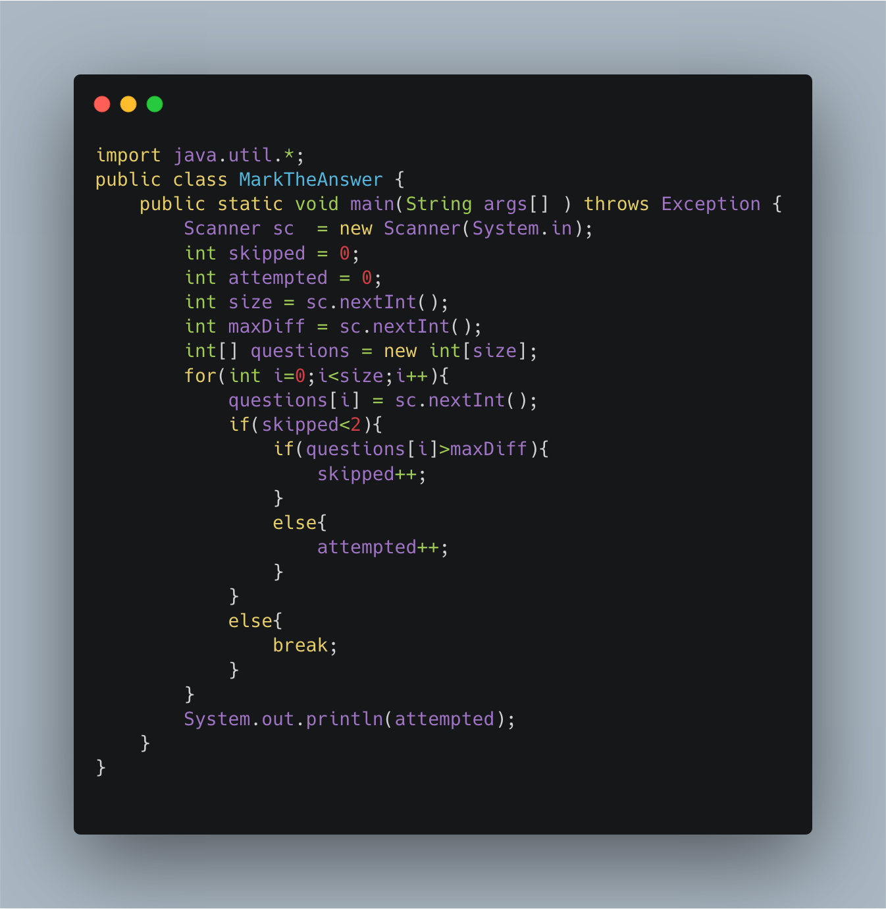

### Mark the Answer

-----

Our friend Monk has an exam that has quite weird rules. Each question has a difficulty level in the form of an Integer. Now, Monk can only solve the problems that have difficulty level less than X . Now the rules are-

    Score of the student is equal to the maximum number of answers he/she has attempted without skipping a question.
    Student is allowed to skip just "one" question that will not be counted in the continuity of the questions.

Note- Assume the student knows the solution to the problem he/she attempts and always starts the paper from first question.

Given the number of Questions, N ,the maximum difficulty level of the problem Monk can solve , X ,and the difficulty level of each question ,

can you help him determine his maximum score?

Input Format
```
First Line contains Integer N , the number of questions and the maximum difficulty X Monk can solve.
Next line contains N integers,denoting the difficulty level of each question.

Output Format
Maximum score Monk can achieve in the exam.
```


----

```
SAMPLE INPUT

7 6
4 3 7 6 7 2 2

SAMPLE OUTPUT
3
```


----




------

##### Solution in C

```objectivec
#include <stdio.h>
int main() {
    int n,max;
    int jump = 0,count=0;
    printf("Enter number of elements: ");
    scanf("%d",&n);
    int arr[n];
    printf("\n Enter the max score: ");
    scanf("%d",&max);
    printf("\n Enter %d elements : \n ",n);
    for(int i=0;i<n;i++){
        scanf("%d",&arr[i]);
    }
    for(int i=0;i<n;i++){
        if(jump<=1){
            if(arr[i]<=max) {
                count++;
            }
            else{
                jump++;
            }
        }
        else{
            break;
        }
    }
    printf("\n Number of subject traverse : %d",count);
    return 0;
}
```
