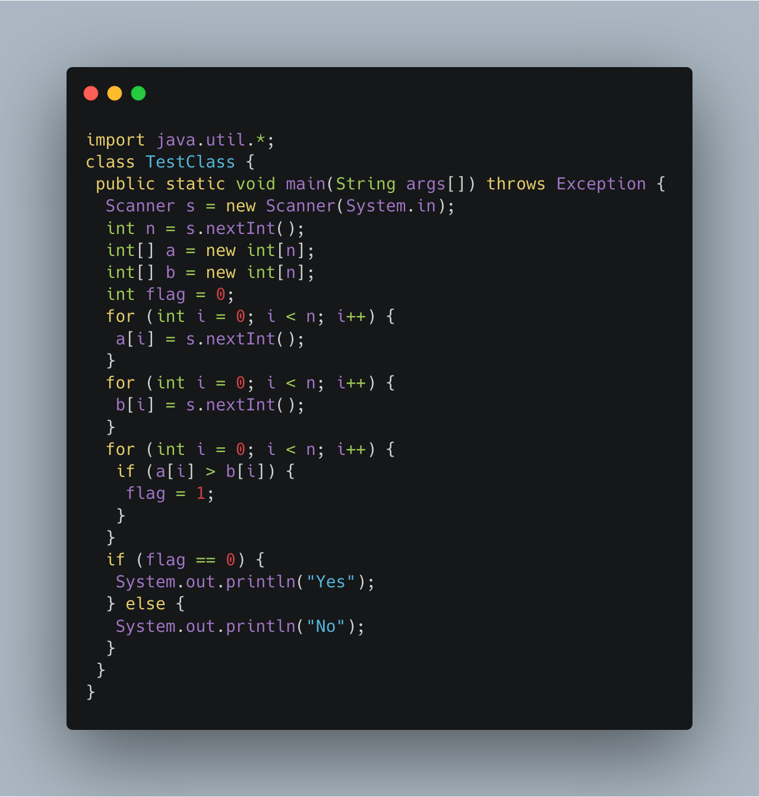

### Save Patient 

----

A new deadly virus has infected large population of a planet. A brilliant scientist has discovered a new strain of virus which can cure this disease. Vaccine produced from this virus has various strength depending on midichlorians count. A person is cured only if midichlorians count in vaccine batch is more than midichlorians count of person. A doctor receives a new set of report which contains midichlorians count of each infected patient, Practo stores all vaccine doctor has and their midichlorians count. You need to determine if doctor can save all patients with the vaccines he has. The number of vaccines and patients are equal.

Input Format
```
First line contains the number of vaccines - N. Second line contains N integers, which are strength of vaccines. Third line contains N integers, which are midichlorians count of patients.
```
Output Format
```
Print a single line containing 'YES' or 'NO' .
```
Input Constraint
```
Strength of vaccines and midichlorians count of patients fit in integer.
```


Sample Input
```
5
123 146 454 542 456
100 328 248 689 200
```
Sample Output
```
NO
```

----

Solution



----

