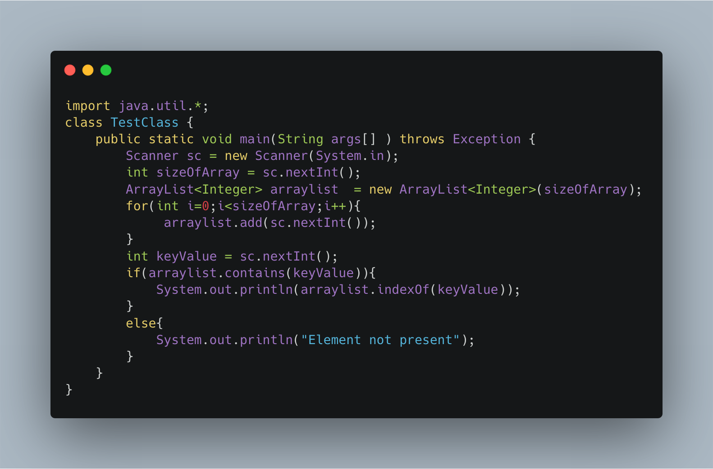

### Simple Search

-----

Given a List of Distinct N number a1,a2,a3........an.
Find The Position Of Number K In The Given List.

Input Format
```
First Line Take Input Value Of N

Second Line Take Input N Space Separated Integer Value

Third Line Take Input Value Of K
```
Output Format
```
Position Of K In The Given List
```
Constraints

    0 < N < 100001
    0 < ai < 1010
    0 < K < 1010

NOTE:
Array Indexing Starts From 0

-----

Example
```
Sample Input
5
1 2 3 4 5
4

SAMPLE OUTPUT
3


```

----

