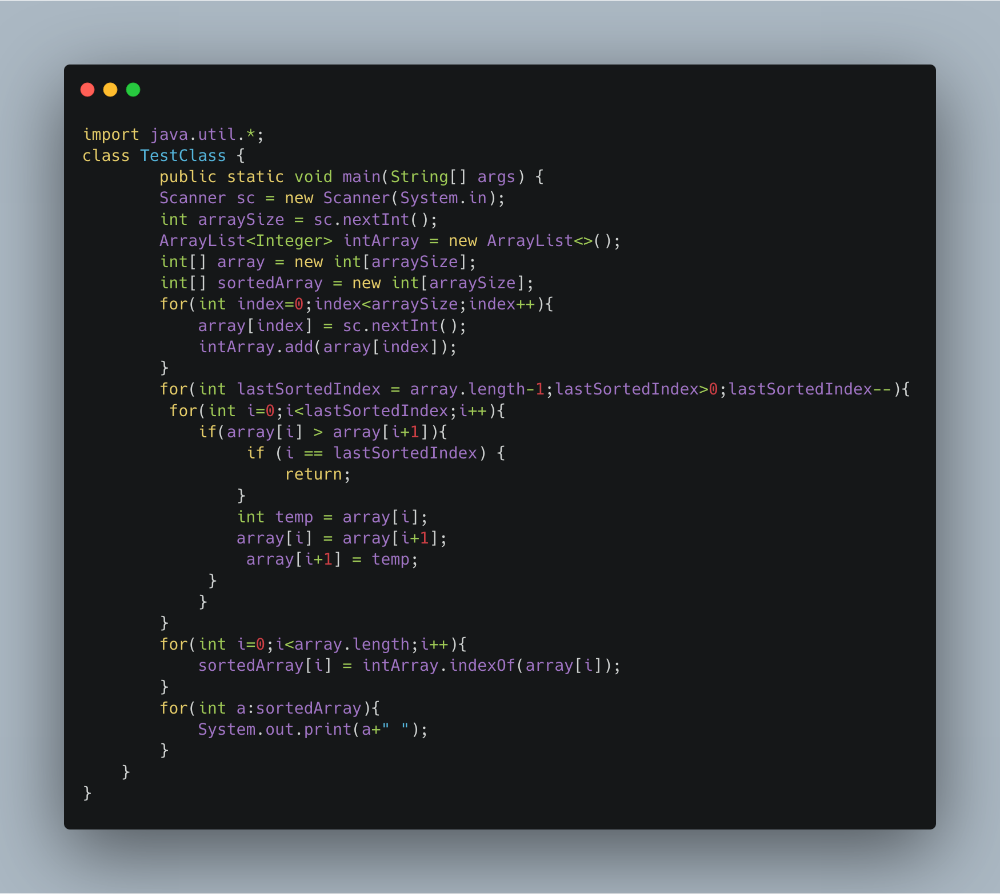

### C.Sort It Out

-----

You are given an array A of non-negative integers of size m. Your task is to sort the array in non-decreasing order and print out the original indices of the new sorted array.

Example:
```
A={4,5,3,7,1}
After sorting the new array becomes A={1,3,4,5,7}.
The required output should be "4 2 0 1 3"   
```

INPUT :
```
The first line of input consists of the size of the array
The next line consists of the array of size m
```
OUTPUT :
```
Output consists of a single line of integers
```
CONSTRAINTS:
```
1<=m<=106

0<=A[i]<=106
```
NOTE: The indexing of the array starts with 0.

Sample input
```
5
4 5 3 7 1
```
Sample Output
```
4 2 0 1 3
```

------

Solution



-------